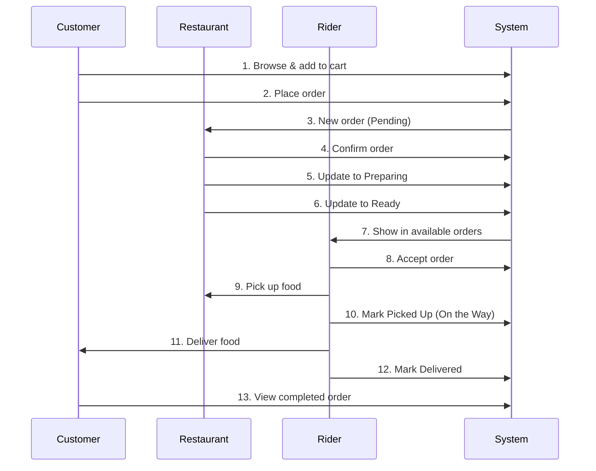

# Food Delivery App - User Guide

## Table of Contents
1. [Setup & Installation](#setup--installation)
2. [Customer App Guide](#customer-app-guide)
3. [Restaurant Panel Guide](#restaurant-panel-guide)
4. [Rider App Guide](#rider-app-guide)
5. [Complete Order Workflow](#complete-order-workflow)

---


## Setup & Installation

### Prerequisites
- Laragon (with PHP 8.3+ and PostgreSQL)
- Web browser (Chrome, Firefox, or Edge)


### Database Setup

1. **Start Laragon** and ensure PostgreSQL is running

2. **Create Database**
   - Open Adminer: `http://localhost/adminer`
   - Login with PostgreSQL credentials
   - Create new database: `food_delivery`

3. **Import Schema**
   - In Adminer, select `food_delivery` database
   - Click "Import" → Choose `database/database-postgresql-adminer.sql`
   - Click "Execute"

4. **Verify Sample Data**
   - Check tables: `users`, `restaurants`, `menu_items`, `riders`, `orders`
   - Sample data should be populated automatically


### Access URLs

| Component | URL | Purpose |
|-----------|-----|---------|
| Customer App | `https://milindbyte.github.io/food_delivery_app_test/customer-app/` | Order food |
| Restaurant Panel | `https://milindbyte.github.io/food_delivery_app_test/restaurant-panel/dashboard.html` | Manage orders |
| Rider App | `https://milindbyte.github.io/food_delivery_app_test/rider-app/dashboard.html` | Deliver orders |

---


## Customer App Guide

### 1. Registration & Login

**Register New Account:**
1. Go to `customer-app/index.html`
2. Click **"Sign up"** in navigation
3. Fill in:
   - Full Name
   - Email
   - Password
   - Phone Number
   - Delivery Address
4. Click **"Sign up"**


**Login:**
1. Click **"Log in"** in navigation
2. Enter credentials:
   - Email: `user1@example.com`
   - Password: `123456` (for demo)
3. Click **"Log in"**


### 2. Browse Restaurants

1. **Home Page** displays all restaurants with:
   - Restaurant photos
   - Ratings
   - Delivery time
   - Price for one
   - Cuisine types
   - Discount offers

2. **Filter by Category** (top of page):
   - Biryani, Burger, Pizza, etc.
   - Click category cards to filter

3. **Restaurant Details**:
   - Click **"View Menu"** to see full menu


### 3. Order Food

**Add Items to Cart:**
1. Click restaurant's **"View Menu"**
2. Browse menu items with:
   - Item photo
   - Name & description
   - Price
   - Veg/Non-Veg indicator
3. Click **"Add to Cart"** for desired items
4. Cart badge updates with item count


**View Cart:**
1. Click **"Cart"** icon in navigation
2. Review:
   - Items added
   - Quantities
   - Prices
3. Adjust quantities with +/- buttons
4. Remove items if needed


**Checkout:**
1. In cart, enter **Delivery Address**
2. Select **Payment Method**:
   - Cash on Delivery (COD)
   - Card
   - UPI
   - Wallet
3. Review total amount
4. Click **"Place Order"**
5. Order confirmation with Order ID


### 4. Track Orders

1. Click **"My Orders"** in navigation
2. View all orders with:
   - Restaurant name
   - Order number
   - Status badge
   - Total amount
   - Order date/time


3. **Order Statuses:**
   - 🟡 **Pending** - Order received
   - 🔵 **Confirmed** - Restaurant confirmed
   - 🔵 **Preparing** - Food being prepared
   - 🔵 **Ready for Pickup** - Ready for rider
   - 🟢 **On the Way** - Rider delivering
   - 🟢 **Delivered** - Order completed
   - 🔴 **Cancelled** - Order cancelled


4. Click **"View Details"** to see:
   - Full order items
   - Delivery address
   - Payment method
   - Total breakdown

---


## Restaurant Panel Guide

### 1. Restaurant Login

**Demo Credentials:**
- Username: `burgerking` / `dominos` / `kfc`
- Password: `admin123`


**Login Steps:**
1. Go to `restaurant-panel/index.html`
2. Enter username and password
3. Click **"Login"**


### 2. Dashboard Overview

After login, dashboard shows:
- **Today's Orders**: Count and revenue
- **Pending Orders**: Requires attention
- **Total Revenue**: All-time earnings
- **Active Orders**: Currently processing


### 3. Manage Orders

**View Orders:**
1. Click **"Orders"** in navigation
2. Filter by status dropdown:
   - All Orders
   - Pending
   - Confirmed
   - Preparing
   - Ready
   - On the Way
   - Delivered


**Update Order Status:**
1. Find the order in list
2. Click **"Update Status"** button
3. Select new status from dropdown
4. Click **"Update"**


**Status Workflow:**
```
Pending → Confirmed → Preparing → Ready → On the Way → Delivered
```


> [!IMPORTANT]
> Always update orders to "Ready" when food is prepared so riders can pick them up!


**Order Details:**
- Order ID & time
- Customer name & phone
- Delivery address
- Items ordered (with quantities)
- Total amount
- Payment method


### 4. Menu Management

1. Click **"Menu"** in navigation
2. View all menu items with:
   - Photo
   - Name & description
   - Price
   - Availability toggle


**Edit Menu Item:**
1. Click **"Edit"** on item
2. Update:
   - Name
   - Description
   - Price
   - Photo URL
   - Veg/Non-Veg
3. Click **"Save Changes"**


**Toggle Availability:**
- Use switch to mark items as Available/Unavailable
- Unavailable items won't show to customers

---


## Rider App Guide

### 1. Rider Login

**Demo Credentials:**
- Email: `rider1@example.com` / `rider2@example.com`
- Password: `123456`

**Login Steps:**
1. Go to `rider-app/index.html`
2. Enter email and password
3. Click **"Login"**


### 2. Dashboard

**Toggle Availability:**
- Use **"Available"/"Unavailable"** toggle
- Only available riders get order assignments
- Shows as green (available) or gray (unavailable)


**Dashboard Stats:**
- Total Deliveries
- Today's Earnings
- Current Rating
- Active Delivery (if any)


### 3. Accept Orders

**View Available Orders:**
1. Dashboard shows all available orders with:
   - Restaurant name & address
   - Customer name & phone
   - Delivery address
   - Order amount
   - Order time


2. Orders with status **"Confirmed"** or **"Ready"** appear here


**Accept Order:**
1. Click **"Accept Order"** button
2. Order moves to your active deliveries
3. Status automatically changes to "Preparing"


> [!TIP]
> Orders marked as "Ready" mean food is already prepared!


### 4. Manage Active Delivery

**Update Status:**
1. Active delivery shows at top
2. Click status button:
   - **"Mark Picked Up"** - When you collect food (changes to "On the Way")
   - **"Mark Delivered"** - When delivered to customer


**View Details:**
- Restaurant address (for pickup)
- Customer address (for delivery)
- Customer phone (for contact)
- Order items
- Payment method


**Navigation:**
- Use phone/address to navigate
- Call customer if needed
- Collect payment if COD


### 5. Delivery History

1. Click **"History"** in bottom navigation
2. View:
   - **Today's Earnings**
   - **Week's Earnings**
   - **Month's Earnings**
   - **Total Earnings**

3. Past deliveries table shows:
   - Order number
   - Restaurant
   - Customer
   - Earnings (delivery fee)
   - Delivery date/time

---


## Complete Order Workflow

### End-to-End Process



### Step-by-Step Example

**Step 1: Customer Orders** (5 minutes)
1. Customer logs in
2. Selects "Burger King"
3. Adds "Whopper" and "Fries" to cart
4. Enters delivery address
5. Chooses "Cash on Delivery"
6. Places order
7. Order status: **Pending**

**Step 2: Restaurant Confirms** (2 minutes)
1. Restaurant sees new order notification
2. Reviews order details
3. Updates status to **Confirmed**
4. Begins preparing food

**Step 3: Restaurant Prepares** (15-20 minutes)
1. Updates status to **Preparing**
2. Cooks the food
3. Packs the order
4. Updates status to **Ready**

**Step 4: Rider Accepts** (2 minutes)
1. Rider (online/available) sees order
2. Reviews pickup & delivery locations
3. Clicks "Accept Order"
4. Goes to restaurant

**Step 5: Pickup & Delivery** (20-30 minutes)
1. Rider arrives at restaurant
2. Collects food
3. Clicks "Mark Picked Up"
4. Status changes to **On the Way**
5. Navigates to customer address
6. Delivers food
7. Collects COD payment (if applicable)
8. Clicks "Mark Delivered"

**Step 6: Completion**
1. Customer views order as **Delivered**
2. Rider earns delivery fee (₹40)
3. Restaurant completes order

---


